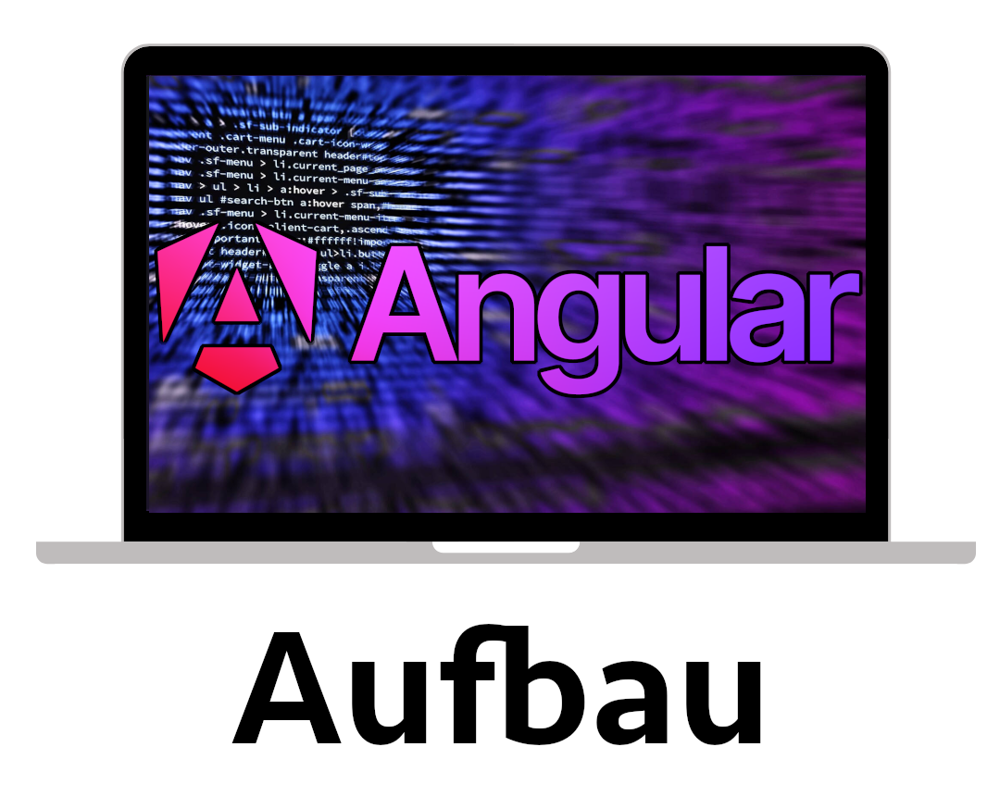

<h2 align="center">
  Angular Aufbau Kurs<br/>
  <a href="https://github.com/KingPaulus" target="_blank">King Paulus</a>
</h2>
<div align="center">
  
</div>

<br/>

<center>

[](https://forthebadge.com) &nbsp;
[](https://forthebadge.com) &nbsp;
[](https://forthebadge.com) &nbsp;

</center>

## Erstellt mit

Dieses Projekt wurde mit den folgenden Technologien entwickelt:

- Angular

## Einrichtung der Entwicklungsumgebung auf MacOs

## Schritte zur Einrichtung

### 1. Repository klonen
```sh
 git clone LINK
```

### 2. [Homebrew](https://brew.sh/) installieren
Führe folgenden Befehl im Terminal aus:
```sh
/bin/bash -c "$(curl -fsSL https://raw.githubusercontent.com/Homebrew/install/HEAD/install.sh)"
```

### 3. [Node.js](https://nodejs.org/en/) installieren
Lade die Installationsdatei von der offiziellen Webseite herunter und folge den Anweisungen zur Installation.

### 4. [NVM (Node Version Manager)](https://github.com/nvm-sh/nvm) installieren
```sh
curl -o- https://raw.githubusercontent.com/nvm-sh/nvm/v0.39.3/install.sh | bash
```

### 5. Angular CLI installieren
```sh
npm install -g @angular/cli
```

### 6. Installation überprüfen
Überprüfe, ob die Installation erfolgreich war, indem du folgende Befehle ausführst:
```sh
nvm -v
node -v
npm -v
ng -v
```

Falls einer der Befehle nicht funktioniert, stelle sicher, dass die Installation korrekt abgeschlossen wurde und überprüfe die Umgebungsvariablen.


## Funktionen

**🎨 Gestaltet mit Angular, Bootstrap und CSS, einfach anpassbare Farben**

**📱 Vollständig responsiv**

In diesem kurs verwenden wir ein Customer Tool, in welchem wir Kunden Anlegen, auflisten, bearbeiten und Löschen können
<div align="center">
  
</div>

<br/>

## Erste Schritte

Klonen Sie dieses Repository. Sie benötigen `node.js` und `git`, die global auf Ihrem Rechner installiert sein müssen.

## 🛠 Installation und Einrichtung

1. Wechseln mit dem Terminal ins Verzeichnis: `cd myProject/`

2. Installation: `npm install`

3. Im Projektverzeichnis können Sie folgendes ausführen: `npm start`

4. Die webseite sollte sich jetzt unter http://localhost:4200/ öffnen

Startet die Anwendung im Entwicklungsmodus.\
Öffnen Sie [http://localhost:4200](http://localhost:4200), um sie im Browser anzusehen.
Die Seite wird neu geladen, wenn Sie Änderungen vornehmen.


## Programm mit Angular

### Für eine neue Seite auf einer anderen Website:

Verwenden Sie folgendes HTML-Tag, um zu einer externen Seite zu verlinken:

`<a href="/">Link zur Startseite</a>`

### Für eine Seite auf dieser Angular-Website:

Verwenden Sie folgendes HTML-Tag, um zu einer Seite auf der aktuellen Angular-Website zu verlinken:

`<a routerLink="/">Link zur Startseite</a>`

